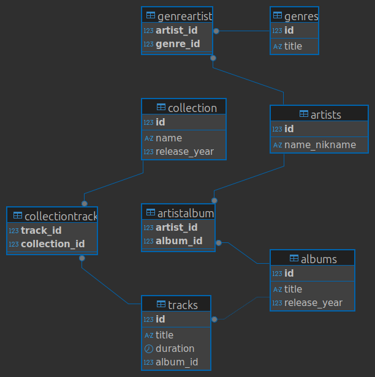

# Домашнее задание «Работа с SQL. Создание БД»

## Решение обязательной части задания:

### 1. Спроектированная схема на сайте https://app.diagrams.net/

### 1.1 Схема сохраненая с dbeaver
  

### 2. SQL скрипты для создания базы данных музыкального приложения

[Скрипт создания таблиц музыкальной базы данных: Music_scheme.sql](scripts/Music_scheme.sql)

## Решение дополнительного задания:

### 1. SQL скрипт для создания таблицы сотрудников

[Скрипт создания таблицы сотрудников Employee.sql](scripts/Employee.sql)
